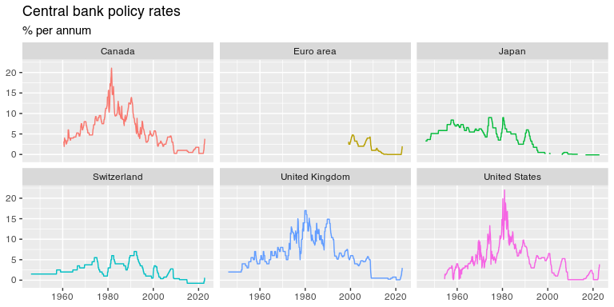

BIS
================

The `BIS` package package provides an `R` interface to data hosted by
the [Bank for International Settlements](https://www.bis.org),
specifically the [single-file data
sets](https://www.bis.org/statistics/full_data_sets.htm) available on
the BIS homepage.

## Install package

The package can be installed from GitHub.

``` r
library(devtools)
install_github("stefanangrick/BIS")  # GitHub
```

## Example usage

To import data, first load the package:

``` r
library("BIS")
```

Next, run the `get_datasets()` function to obtain a list of available
data sets:

``` r
ds <- get_datasets()
head(ds, 20)
```

    ## # A tibble: 20 × 3
    ##    name                                                          id        url  
    ##    <chr>                                                         <chr>     <chr>
    ##  1 Locational banking statistics                                 full_lbs… http…
    ##  2 Consolidated banking statistics                               full_cbs… http…
    ##  3 Debt securities statistics                                    full_deb… http…
    ##  4 Credit to the non-financial sector                            full_tc_… http…
    ##  5 Credit-to-GDP gaps                                            full_cre… http…
    ##  6 Debt service ratios for the private non-financial sector      full_dsr… http…
    ##  7 Global liquidity indicators                                   full_gli… http…
    ##  8 Exchange-traded derivatives statistics                        full_xtd… http…
    ##  9 OTC derivatives outstanding                                   full_otc… http…
    ## 10 US dollar exchange rates (monthly, quarterly and annual)      full_xru… http…
    ## 11 US dollar exchange rates (daily, horizontal time axis)        full_xru… http…
    ## 12 US dollar exchange rates (daily, vertical time axis)          full_xru… http…
    ## 13 Effective exchange rate indices (monthly)                     full_eer… http…
    ## 14 Effective exchange rate indices (daily, horizontal time axis) full_eer… http…
    ## 15 Effective exchange rate indices (daily, vertical time axis)   full_eer… http…
    ## 16 Triennial Survey statistics on turnover                       full_der… http…
    ## 17 Property prices: selected series                              full_spp… http…
    ## 18 Property prices: long series                                  full_bis… http…
    ## 19 Payments and financial market infrastructures statistics      full_bis… http…
    ## 20 Consumer prices                                               full_lon… http…

The `get_datasets()` function returns a
[tibble](https://tibble.tidyverse.org/) data frame listing the available
data sets. The column `url` can be used as input for the `get_bis()`
function which downloads, parses and imports the corresponding data set.

To import monthly-frequency data on [central banks’ policy
rates](https://www.bis.org/statistics/cbpol.htm), run:

``` r
rates <- get_bis(ds$url[ds$id == "full_cbpol_m_csv"])
head(rates)
```

    ## # A tibble: 6 × 15
    ##   freq  freque…¹ ref_a…² refer…³ time_…⁴ time_…⁵ compi…⁶ decim…⁷ decim…⁸ sourc…⁹
    ##   <chr> <chr>    <chr>   <chr>   <chr>   <chr>   <chr>   <chr>   <chr>   <chr>  
    ## 1 M     Monthly  AR      Argent… <NA>    <NA>    From 0… 4       Four    Centra…
    ## 2 M     Monthly  AR      Argent… <NA>    <NA>    From 0… 4       Four    Centra…
    ## 3 M     Monthly  AR      Argent… <NA>    <NA>    From 0… 4       Four    Centra…
    ## 4 M     Monthly  AR      Argent… <NA>    <NA>    From 0… 4       Four    Centra…
    ## 5 M     Monthly  AR      Argent… <NA>    <NA>    From 0… 4       Four    Centra…
    ## 6 M     Monthly  AR      Argent… <NA>    <NA>    From 0… 4       Four    Centra…
    ## # … with 5 more variables: supp_info_breaks <chr>, title <chr>, series <chr>,
    ## #   date <chr>, obs_value <dbl>, and abbreviated variable names ¹​frequency,
    ## #   ²​ref_area, ³​reference_area, ⁴​time_format, ⁵​time_format.1, ⁶​compilation,
    ## #   ⁷​decimals, ⁸​decimals.1, ⁹​source_ref

To plot the data using [ggplot2](https://ggplot2.tidyverse.org), run the
following:

``` r
library("dplyr")
library("ggplot2")
library("zoo")

rates_plot <- subset(rates, ref_area %in% c("US", "XM", "JP", "GB", "CH", "CA"))
rates_plot <- mutate(rates_plot, date = as.Date(as.yearmon(date, format = "%Y-%m")))

ggplot(rates_plot, aes(date, obs_value, color = reference_area)) +
  geom_line(show.legend = FALSE) +
  facet_wrap(~reference_area) +
  labs(title = "Central bank policy rates",
       subtitle = "% per annum", x = NULL, y = NULL)
```

<!-- -->

Note that BIS data sets come with a number of different time formats.
The [zoo](https://cran.r-project.org/package=zoo) package
(e.g. `as.yearmon()`) should be able to parse most formats.

## Large data sets

Large data sets (e.g. the Locational banking statistics and Debt
securities statistics) may cause `get_bis()` to fail if the amount of
available memory is insufficient for executing a required pivot
operation. As a workaround, users may wish to set `auto_pivot = FALSE`
when calling `get_bis()`, then subset the data and run
`pivot_longer_bis()` manually.

``` r
options(timeout = 600)
lbs <- get_bis(ds$url[(ds$id == "full_lbs_d_pub_csv")], auto_pivot = FALSE)
lbs <- subset(lbs, l_parent_cty %in% c("US", "DE", "JP"))
lbs <- pivot_longer_bis(lbs)
```

## Retrieve individual data series

To retrieve individual data series instead of full data sets, consider
using the BIS [SDMX RESTful API](https://stats.bis.org/api-doc/v1/#/).
The [rsdmx R package](https://cran.r-project.org/package=rsdmx) is able
to process SDMX data within R. The latest rsdmx [development
version](https://github.com/opensdmx/rsdmx) contains a BIS connector
that streamlines the process.

## Note

This package is in no way officially related to or endorsed by the [Bank
for International Settlements](https://www.bis.org/). It’s based on a
fork of
[CC0](https://cran.r-project.org/src/contrib/Archive/BIS/)-licensed
[code by expersso](https://github.com/expersso/BIS). Please don’t abuse
the BIS’s servers with unnecessary calls.
