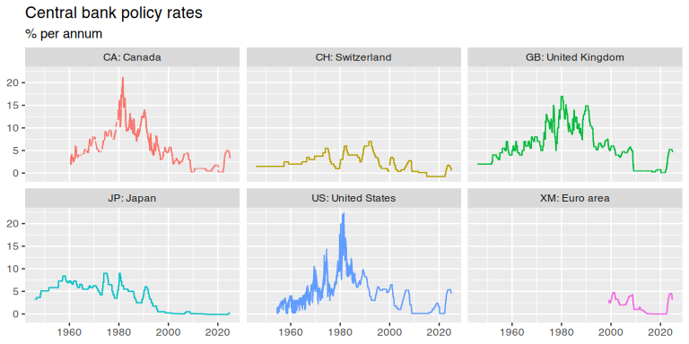

BIS
================

[](http://cran.r-project.org/package=BIS)
[](http://cran.r-project.org/package=BIS)

The `BIS` package provides an `R` interface to data hosted by the [Bank
for International Settlements](https://www.bis.org), specifically the
[single-file data
sets](https://www.bis.org/statistics/full_data_sets.htm) available on
the BIS homepage.

## Installing the package

You can install the package from CRAN or GitHub.

``` r
library(devtools)
install_github("stefanangrick/BIS")  # GitHub
install.packages("BIS")              # CRAN
```

## Example usage

To start using the package, load it into your R session.

``` r
library("BIS")
```

Next, retrieve a list of available data sets using the `get_datasets()`
function.

``` r
ds <- get_datasets()
head(ds, 20)
```

    ## # A tibble: 20 × 3
    ##    name                                                              id    url  
    ##    <chr>                                                             <chr> <chr>
    ##  1 Locational banking statistics (CSV, flat)10 Dec 2024              WS_L… http…
    ##  2 Consolidated banking statistics (CSV, flat)10 Dec 2024            WS_C… http…
    ##  3 Debt securities statistics (CSV, flat)10 Dec 2024                 WS_N… http…
    ##  4 International debt securities (BIS-compiled) (CSV, flat)10 Dec 2… WS_D… http…
    ##  5 Credit to the non-financial sector (CSV, flat)10 Dec 2024         WS_T… http…
    ##  6 Credit-to-GDP gaps (CSV, flat)10 Dec 2024                         WS_C… http…
    ##  7 Debt service ratios (CSV, flat)10 Dec 2024                        WS_D… http…
    ##  8 Global liquidity indicators (CSV, flat)10 Dec 2024                WS_G… http…
    ##  9 Exchange traded derivatives (CSV, flat)10 Dec 2024                WS_X… http…
    ## 10 OTC derivatives statistics (CSV, flat)10 Dec 2024                 WS_O… http…
    ## 11 Triennial survey (CSV, flat)5 Dec 2022                            WS_D… http…
    ## 12 Selected residential property prices (CSV, flat)19 Dec 2024       WS_S… http…
    ## 13 Detailed residential property prices (CSV, flat)19 Dec 2024       WS_D… http…
    ## 14 Commercial property prices (CSV, flat)19 Dec 2024                 WS_C… http…
    ## 15 Consumer prices index (CSV, flat)19 Dec 2024                      WS_L… http…
    ## 16 Bilateral exchange rates (CSV, flat)19 Dec 2024                   WS_X… http…
    ## 17 Effective exchange rates (CSV, flat)19 Dec 2024                   WS_E… http…
    ## 18 Central bank total assets (CSV, flat)28 Nov 2024                  WS_C… http…
    ## 19 Central bank policy rates (CSV, flat)19 Dec 2024                  WS_C… http…
    ## 20 CPMI comparative tables type 1 (CSV, flat)                        WS_C… http…

The `get_datasets()` function returns a
[tibble](https://tibble.tidyverse.org/) data frame listing available
data sets. Use the `url` column as input for the `get_bis()` function to
download, parse, and import the corresponding data set.

For example, to import monthly-frequency data on [central banks’ policy
rates](https://www.bis.org/statistics/cbpol.htm), use the following
code:

``` r
rates <- get_bis(ds$url[ds$id == "WS_CBPOL_csv_flat"])
head(rates)
```

    ## # A tibble: 6 × 18
    ##   structure structure_id             action freq  ref_area time_period obs_value
    ##   <chr>     <chr>                    <chr>  <chr> <chr>    <chr>           <dbl>
    ## 1 dataflow  BIS:WS_CBPOL(1.0): Cent… I      M: M… CH: Swi… 1946-01           1.5
    ## 2 dataflow  BIS:WS_CBPOL(1.0): Cent… I      M: M… CH: Swi… 1946-02           1.5
    ## 3 dataflow  BIS:WS_CBPOL(1.0): Cent… I      M: M… CH: Swi… 1946-03           1.5
    ## 4 dataflow  BIS:WS_CBPOL(1.0): Cent… I      M: M… CH: Swi… 1946-04           1.5
    ## 5 dataflow  BIS:WS_CBPOL(1.0): Cent… I      M: M… CH: Swi… 1946-05           1.5
    ## 6 dataflow  BIS:WS_CBPOL(1.0): Cent… I      M: M… CH: Swi… 1946-06           1.5
    ## # ℹ 11 more variables: unit_measure <chr>, unit_mult <chr>, time_format <chr>,
    ## #   compilation <chr>, decimals <chr>, source_ref <chr>,
    ## #   supp_info_breaks <chr>, title <chr>, obs_status <chr>, obs_conf <chr>,
    ## #   obs_pre_break <chr>

To plot the data with [ggplot2](https://ggplot2.tidyverse.org), run the
following:

``` r
library("dplyr")
library("ggplot2")
library("zoo")

rates_plot <- subset(rates, ref_area %in% c("US", "XM", "JP", "GB", "CH", "CA"))
rates_plot <- subset(rates, ref_area %in% c("US: United States",
                                            "XM: Euro area",
                                            "JP: Japan",
                                            "GB: United Kingdom",
                                            "CH: Switzerland",
                                            "CA: Canada"))
rates_plot <- mutate(rates_plot, time_period =
                       as.Date(as.yearmon(time_period, format = "%Y-%m")))

ggplot(rates_plot, aes(time_period, obs_value, color = ref_area)) +
  geom_line(show.legend = FALSE) +
  facet_wrap(~ref_area) +
  labs(title = "Central bank policy rates",
       subtitle = "% per annum", x = NULL, y = NULL)
```

<!-- -->

Note that BIS data sets use various time formats. The
[zoo](https://cran.r-project.org/package=zoo) package (e.g.,
`as.yearmon()`) can handle most of these formats.

## Reading locally stored files

In some cases, the BIS homepage may only be accessible through a web
browser, preventing the programmatic retrieval of data sets directly
within R. When this occurs, users can manually download the files and
use the `read_bis()` function to parse them.

To read a locally stored CSV file, use the following code:

``` r
df <- read_bis("WS_CBPOL_csv_flat.csv")
```

To read a locally stored ZIP file, use this code:

``` r
df <- read_bis(.unzip_file("WS_CBPOL_csv_flat.zip"))
```

## Retrieving individual data series

To retrieve individual data series instead of full data sets, consider
using the BIS [SDMX RESTful API](https://stats.bis.org/api-doc/v1/#/).
The [rsdmx R package](https://cran.r-project.org/package=rsdmx) supports
processing SDMX data in R. The latest [development
version](https://github.com/opensdmx/rsdmx) of `rsdmx` includes a BIS
connector to streamline the process.

## Note

This package is neither officially related to nor endorsed by the [Bank
for International Settlements](https://www.bis.org/). It is based on a
fork of
[CC0](https://cran.r-project.org/src/contrib/Archive/BIS/)-licensed
[code by expersso](https://github.com/expersso/BIS). Please avoid
overloading the BIS servers with unnecessary requests.
